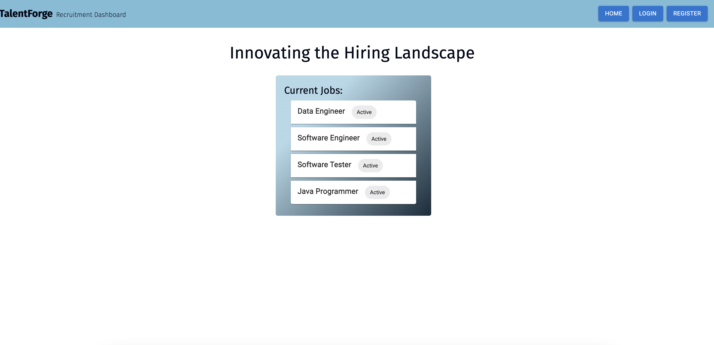
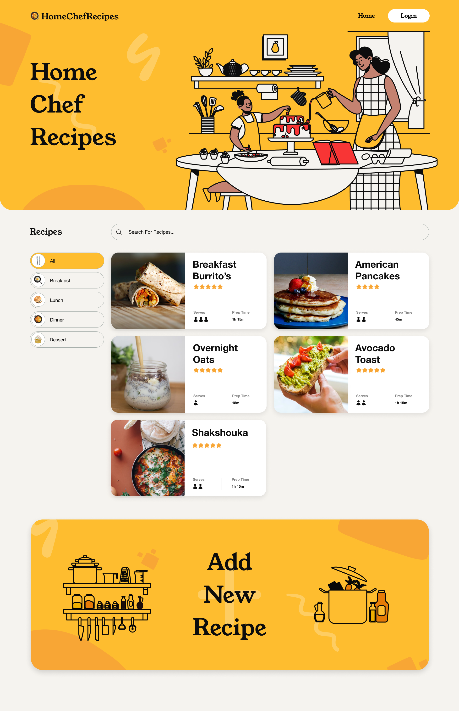

<h1 align='center' style='color:#0E3386;'>Hi there 👋, I'm Shruti 😊</h1>

  Aspiring Front-End Developer

I am a former technical recruiter, currently transitioning into a software engineering role. I completed a rigorous 10-week full-stack coding boot camp at <a href="https://www.mindmingle.nl/certificates/fmqolnwgnfldlw1">Mind-Mingle</a>.Throughout the program, I honed my technical skills in TypeScript, HTML, and CSS using the NextJS framework to build web applications. My background in talent acquisition has equipped me with valuable insights into team building and navigating the tech industry. This experience has instilled in me the confidence to seamlessly integrate into collaborative environments. I am enthusiastic about bringing my unique blend of technical expertise, team-building experience, and positive outlook to an organization. At present, I am actively seeking job opportunities where I can apply my newly acquired skills and contribute to solving real-world problems or projects

  &nbsp;&nbsp;&nbsp;&nbsp;
  &nbsp;&nbsp;&nbsp;&nbsp;

<h3 align="left">Skills</h3>
<h5>FRONT END</h5>

  &nbsp;&nbsp;
  &nbsp;&nbsp;
  &nbsp;&nbsp;
  &nbsp;&nbsp;
  &nbsp;&nbsp;
  &nbsp;&nbsp;
  &nbsp;&nbsp;

<h5>BACKEND</h5>

  &nbsp;&nbsp;
  &nbsp;&nbsp;

<h5>TESTING</h5>

  &nbsp;&nbsp;
  &nbsp;&nbsp;
  

<h3 align="left">Project</h3>

### Talent Forge
- **Description**: The project aims to address the needs of three different user groups (recruiters, hiring managers, and candidates) for their hiring processes. The application enables candidates to create profiles, view open roles, and submit applications. For recruiters, it serves as a platform to manage roles, and applicants, and create new job listings. Hiring managers can oversee open/closed roles, manage applicant status, and create new job listings.

 - **Features**:
    - Implemented a secure user authentication system for all user types
    - Status dashboard available for all personas
    - Enabled candidates to upload images & resume
    - Implemented a system for recruiters & hiring managers to provide feedback on rejection
 - **Tech Stack**:

   - **Frontend**: NextJS, React, Typescript
   - **Backend**:Prisma ORM, Express
   - **Styling**: Tailwind CSS, MUI, Shadcn

   [Link to the Project](https://recruitment-dashboard-frontend.vercel.app/)

 
 

 ### Home Chef Recipe

- **Description**: A go-to source for quick, delicious recipes. Dive into a communit where you can discover, rate, and share culinary creations or contribute your favorites.

 - **Features**:
    - Registration and login functionality using JWT for authentication, bcrypt for password hashing, and Zod for data validation.
    - Access to all recipes without the need for registration.
    - Detailed recipe information view, including ingredients and cooking instructions.
    - Dashboard page for registered users where they can add,edit, and delete their recipes.
    - Comment form to provide ratings and comments for displayed recipes.
    - User-friendly and responsive design with a modern look or an enjoyable user experience.

  - **Tech Stack**:

     - **Frontend**: NextJS, React, Typescript
     - **Backend**:Prisma ORM, Express
     - **Styling**: Tailwind CSS, MUI, Shadcn

 

<!--
**JShruti/JShruti** is a ✨ _special_ ✨ repository because its `README.md` (this file) appears on your GitHub profile.

Here are some ideas to get you started:

- 🔭 I’m currently working on ...
- 🌱 I’m currently learning ...
- 👯 I’m looking to collaborate on ...
- 🤔 I’m looking for help with ...
- 💬 Ask me about ...
- 📫 How to reach me: ...
- 😄 Pronouns: ...
- ⚡ Fun fact: ...
-->
